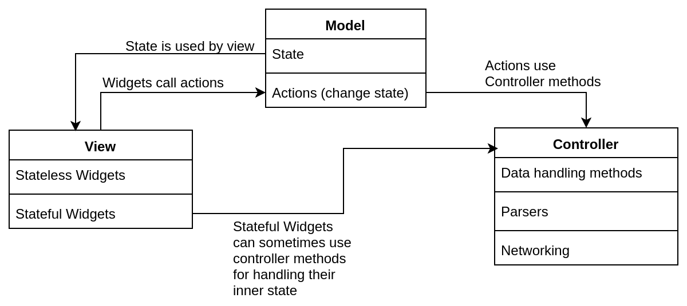

## How to run

### Main requirements

This is a Flutter project, totally compatible with Android and iOS. To run it, you need to have Flutter installed on your machine. If you don't, you can follow the instructions on https://flutter.dev/docs/get-started/install.

### Further requirements

In order to submit bug reports to the Github API (needed in order to enable in-app bug reporting), a Github Personal Access Token is required. If you don't have one, you can create it on https://github.com/settings/tokens. The only permission it needs is **repo > public_repo**.

The token is read from the file assets/env/env.json, which you may need to create, and must be in the following format:

```json
{
  "gh_token" : "your super secret token"
}
```

### Automated formatting

In order to contribute, you must format you files using `dart format` manually or formatting on save using your IDE automatically, or you can install the git pre-commit hook doing the following command at the root of the directory that automatically formats staged files:

``` bash
  chmod +x pre-commit-hook.sh && ./pre-commit-hook.sh
```


## Project structure

### Overview

For this project, we separate the code into *model, *view* and *controller*.
By making sure view-only components are clear from the rest of the code, we can assure safe reuse of widgets as well as separated testing and development.



### Model
The *model* represents the entities that are used in the app, including the session, the classes, the exams. They should be generated from the controller's methods and passed to the view. The model should not contain logic, but only the data that is needed to display the information.

### View

The *view* part of the app is made of *widgets* (stateful or stateless). They each should deal with their own responsibility (display and/or gather information) and any changes to the overall app should be passed up to their parents (using callbacks) until they reach the current page's widget, where the information will be handled. If this is not possible (e.g. updated state shall be used by more than one widget subtree), a state [provider](https://pub.dev/packages/provider) should be used.

> **Note:** if a widget's responsibility includes handling information (for example, a date-picking widget that transforms the user input into a date format), it should be done within the widget itself (may or may not use methods in the controller package depending on the complexity of the code)

### Controller

The *controller* directory contains all artifacts that are not directly related to the view or the model. This includes the parsers, the networking code, the database code and the logic that handles the global state of the app.